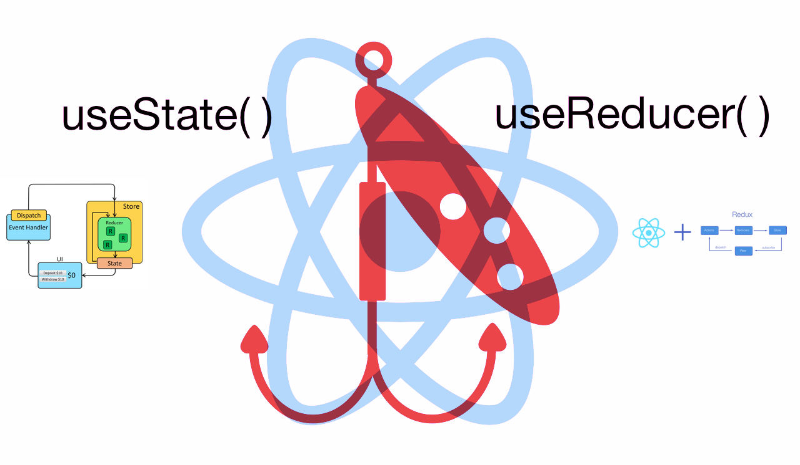
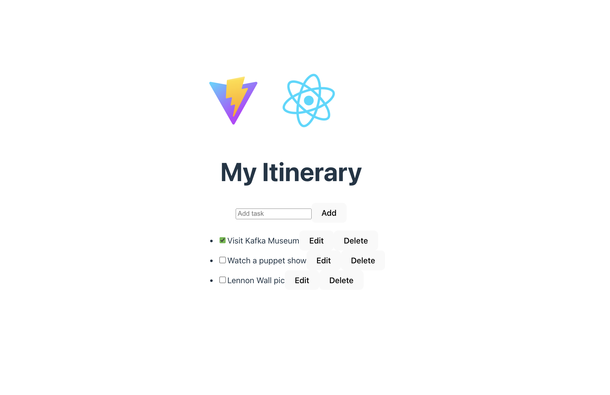

# react-task-app-reducer-example
react example for state and reducer - https://react.dev/learn/managing-state 




```jsx 
const [state,setState] = useState()
const [items, dispatch] = useReducer(itemReducer, initialItems)
```

# Example Preview
